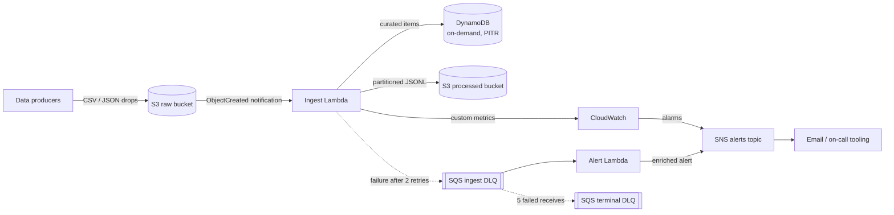

# AWS Serverless ETL Pipeline

An event-driven, serverless ETL pipeline on AWS. Files dropped into a raw S3 bucket are validated, normalized, and loaded into DynamoDB and a partitioned, Athena-ready S3 layout — with idempotent processing, structured logging, custom CloudWatch metrics, and a dead-letter path that turns every failure into an actionable alert.

Built with Python 3.12, boto3, and Terraform. Tested with pytest and moto.

## Architecture



## Event Flow

1. A producer drops a `.csv`, `.json`, `.jsonl`, or `.ndjson` file anywhere in the raw bucket.
2. S3 sends an `ObjectCreated` notification, invoking the ingest Lambda asynchronously.
3. The function downloads the object, computes its SHA-256 digest, and claims that digest in DynamoDB with a conditional put. If the claim already exists, the file is a duplicate and processing stops there.
4. Rows are parsed and validated against the order schema. Values are normalized: strings stripped, currency upper-cased, status lower-cased, dates coerced to `YYYY-MM-DD`.
5. Valid records are batch-written to DynamoDB with capped exponential backoff on `UnprocessedItems`.
6. The same records are written to the processed bucket as newline-delimited JSON in a Hive-partitioned layout (`dataset=orders/dt=2026-06-30/part-<hash>.jsonl`), ready for Athena or Glue. Part names derive from the source content hash, so retried writes overwrite rather than duplicate.
7. Custom metrics (`RecordsWritten`, `RecordsRejected`, `FilesProcessed`, `FilesSkippedDuplicate`, `ProcessingSeconds`) are published to the `ServerlessEtl` namespace.

## Error Handling and DLQ Strategy

The pipeline distinguishes between row-level and file-level failures:

- **Row-level**: an invalid row is logged with its index and field errors, counted in the `RecordsRejected` metric, and skipped. Good rows in the same file still load.
- **File-level**: when more than `MAX_INVALID_RATIO` (default 50 percent) of rows fail validation — or the file is unreadable, malformed, or DynamoDB writes can't drain — the whole invocation fails. The idempotency claim is released first so a retry can reprocess the file from scratch.

Failure routing after that point is fully automated:

1. Lambda retries the async invocation twice (events older than one hour are dropped to the DLQ rather than retried stale).
2. Exhausted events land on the SQS ingest DLQ with `RequestID`, `ErrorCode`, and `ErrorMessage` attached as message attributes.
3. The alert Lambda consumes the DLQ, enriches each message (environment, failed S3 URIs, receive count, first-failure time, runbook hint), and publishes it to the SNS alerts topic. It uses partial batch responses, so one bad message never blocks the rest.
4. Messages the alert function itself can't handle after five receives move to a terminal DLQ, which has its own depth alarm — nothing is silently dropped.

Recovery is a redrive: fix the input or the code, then move messages back with SQS `StartMessageMoveTask`. Because idempotency is keyed on content hash and processed-bucket part names are deterministic, reprocessing is always safe.

CloudWatch alarms cover ingest errors, throttles, both DLQ depths, and a sustained spike in rejected rows.

## Idempotency

Duplicate S3 events, Lambda retries, and re-uploads of the same file are all handled by one mechanism: a conditional `PutItem` on the object's content hash (`pk = FILE#<sha256>`). The first invocation wins the claim; every subsequent delivery of the same bytes is skipped and counted in the `FilesSkippedDuplicate` metric. DynamoDB order items are also naturally idempotent, since they're keyed on `order_id` and re-puts converge.

## Project Layout

```
├── src/
│   ├── functions/
│   │   ├── ingest/handler.py    # S3 event -> validate -> DynamoDB + processed bucket
│   │   └── alert/handler.py     # DLQ -> enrich -> SNS
│   └── shared/                  # Packaged as a Lambda layer
│       ├── logger.py            # Structured JSON logging
│       ├── schemas.py           # Stdlib-only schema validation
│       ├── s3_utils.py          # Event parsing, file decoding, partitioned writes
│       └── dynamo.py            # Batch writes with backoff, idempotency claims
├── tests/                       # pytest + moto
├── infra/                       # Terraform (buckets, table, functions, queues, alarms)
├── events/                      # Sample events and input files
└── .github/workflows/ci.yml     # Lint, test, validate, gated deploy
```

## Local Development

Requires Python 3.12 and, for deployment, Terraform 1.7 or later.

```bash
make install     # create .venv and install dev dependencies
make lint        # ruff check + format check
make test        # pytest with coverage
make package     # build dist/layer.zip, dist/ingest.zip, dist/alert.zip
```

Exercise a handler locally against the sample fixtures:

```python
from tests.helpers import make_s3_event  # or load events/s3-put-event.json
```

The files under `events/` mirror real AWS payloads: an S3 `ObjectCreated` notification, a dead-lettered SQS message with Lambda's error attributes, and valid plus intentionally broken input data.

## Testing

The suite uses [moto](https://github.com/getmoto/moto) to run the handlers against in-memory AWS services — no credentials or network access needed. Coverage includes:

- End-to-end ingest runs: CSV and JSON happy paths, curated item shape, partitioned output layout
- Idempotency: duplicate content skipped, claims released on failure so retries work
- Failure modes: mostly-invalid files, unsupported extensions, missing objects, empty files
- DynamoDB retry behavior, driven by fake clients that return `UnprocessedItems`
- Alert enrichment, SNS subject limits, and partial batch failure reporting

```bash
make test
```

## Deployment

Configuration lives in `infra/terraform.tfvars` (see `terraform.tfvars.example`).

```bash
make package                 # build the Lambda artifacts Terraform references
make plan                    # terraform init + plan
make deploy                  # terraform init + apply
```

CI deploys automatically: the `deploy` job in `.github/workflows/ci.yml` runs only on pushes to `main`, behind a `production` environment gate, and authenticates to AWS with GitHub OIDC (no long-lived keys). It expects `AWS_DEPLOY_ROLE_ARN` and `TF_STATE_BUCKET` secrets plus an `AWS_REGION` variable.

### Configuration

| Environment variable | Function | Default | Purpose |
| --- | --- | --- | --- |
| `DYNAMODB_TABLE` | ingest | — | Curated table name |
| `PROCESSED_BUCKET` | ingest | — | Curated output bucket |
| `METRICS_NAMESPACE` | ingest | `ServerlessEtl` | CloudWatch namespace |
| `DATASET_NAME` | ingest | `orders` | Partition prefix and metric dimension |
| `MAX_INVALID_RATIO` | ingest | `0.5` | File-failure threshold |
| `SNS_TOPIC_ARN` | alert | — | Alert destination |
| `ENVIRONMENT` | alert | `dev` | Alert context |
| `PIPELINE_NAME` | alert | `serverless-etl` | Pipeline identifier in alerts |
| `LOG_LEVEL` | both | `INFO` | Structured logger level |

## Design Notes

- boto3 clients are created at module import, so warm invocations reuse connections.
- The shared library ships as a Lambda layer; function zips contain only their handler.
- IAM roles are least-privilege: the ingest role can read the raw bucket, write the processed bucket and table, publish to one metric namespace, and send to its own DLQ — nothing else.
- Curated output is newline-delimited JSON in a Hive-partitioned layout. Swapping in Parquet is a contained change to `shared/s3_utils.py` (add a `pyarrow` layer); the partition scheme, idempotent part naming, and everything downstream stay the same.
- Metric publishing is best-effort by design: an observability outage should never fail data processing.

## License

MIT — see [LICENSE](LICENSE). Copyright (c) 2026 Wajahat Uddin Syed.
